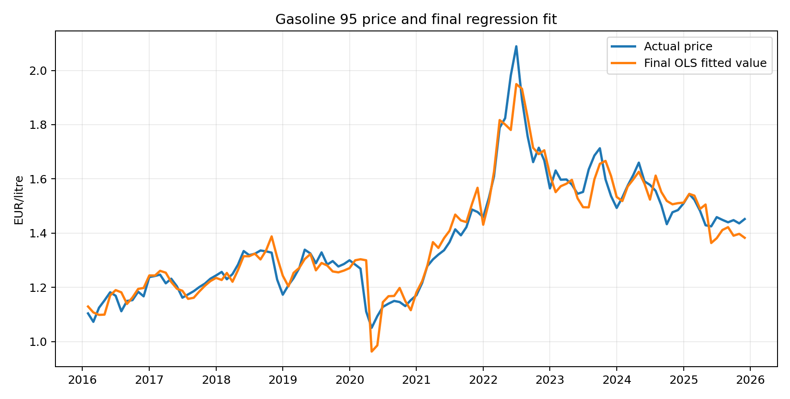
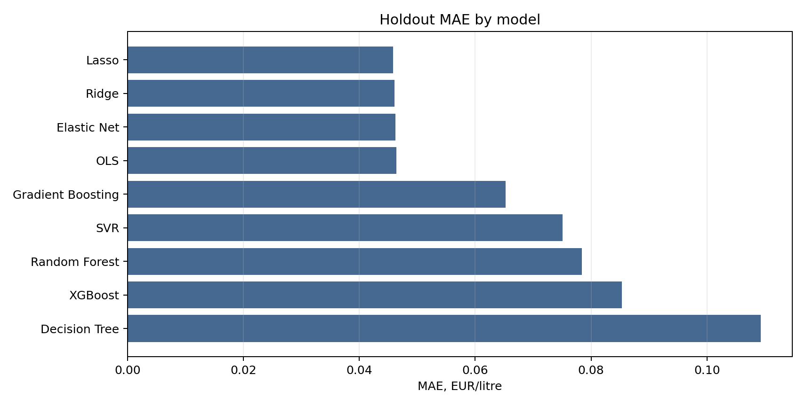
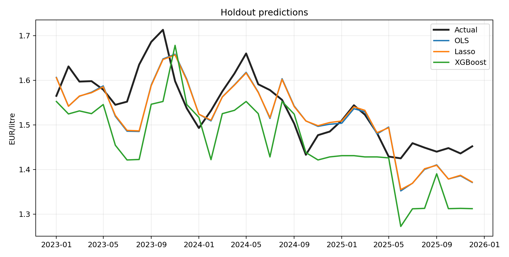

# Gasoline 95 Price Model Review

## Regression diagnostics and challenger assessment

### Recommendation

Use the final OLS regression with HC3 robust standard errors as the analytical baseline. Do not treat it as a production forecasting model without additional validation.

The challenger standard used in this review is simple: a replacement model should show a clear improvement in holdout error or provide a stability benefit that compensates for lower transparency. No challenger meets that standard. Lasso gives the lowest holdout MAE at **0.0458 EUR/litre**. OLS gives **0.0464 EUR/litre**, only **0.0006 EUR/litre** higher.

The OLS specification also keeps the main economic relationship visible. Before the COVID/post-COVID period, a one-dollar increase in lagged Brent is associated with an increase of about **0.0058 EUR/litre** in the retail price. With the interaction term, the implied Brent slope during the COVID/post-COVID regime rises to about **0.0090 EUR/litre**.

### Scope

This note reviews the final regression from the econometric analysis and tests whether common challenger models justify replacing it. The original regression work focused on selecting a linear specification after checking issues such as multicollinearity, heteroskedasticity and variable relevance. The challenger review is a second step, not a replacement for those diagnostics.

The dataset contains monthly observations from **2016-01 to 2025-12**. After lag construction, the effective modelling sample starts in **2016-02** and contains **119 observations**.

The dependent variable is `pvp`, the retail price of Gasoline 95 in Lleida, measured in EUR/litre. The final model uses:

- `brent_lag1`: Brent crude oil price lagged one month.
- `fx`: USD/EUR exchange rate.
- `covid_post`: dummy equal to 1 from March 2020 onward.
- `brent_lag1_x_covid_post`: interaction between lagged Brent and the COVID/post-COVID dummy.

The tax variable is excluded from the final model. It improves in-sample fit, but it is too close to the retail price by construction and weakens the model as an independent explanation.

### Review Design

The challenger review keeps the information set fixed. OLS, Ridge, Lasso, Elastic Net, Decision Tree, Random Forest, Gradient Boosting, XGBoost and SVR all use the same four final features. The purpose is to test the estimator choice, not to mix model comparison with feature engineering.

The split is chronological: observations before **2023-01-01** are used for training and observations from **2023-01-01** onward are used as holdout data. The main metrics are MAE and RMSE in EUR/litre. Holdout R-squared and average prediction bias are secondary checks.

### Final Regression Specification

```text
pvp_t = beta0
      + beta1 * brent_lag1_t
      + beta2 * fx_t
      + beta3 * covid_post_t
      + beta4 * brent_lag1_t * covid_post_t
      + error_t
```

Standard errors are HC3 robust standard errors.

| term                    | coef    | robust_se | p_value | ci_low  | ci_high |
| ----------------------- | ------- | --------- | ------- | ------- | ------- |
| const                   | 1.4666  | 0.1180    | 0.0000  | 1.2353  | 1.6980  |
| brent_lag1              | 0.0058  | 0.0005    | 0.0000  | 0.0049  | 0.0068  |
| fx                      | -0.5044 | 0.1110    | 0.0000  | -0.7221 | -0.2868 |
| covid_post              | -0.0853 | 0.0605    | 0.1582  | -0.2038 | 0.0332  |
| brent_lag1_x_covid_post | 0.0031  | 0.0009    | 0.0006  | 0.0013  | 0.0049  |

The regression has an in-sample R-squared of **0.9403** and an adjusted R-squared of **0.9382**. This is an explanatory model, not a causal estimate.



### Challenger Results

The regularized linear models are the closest challengers. They slightly reduce holdout error, but the difference is too small to change the model decision.

| model             | method_type                     | MAE    | RMSE   | R2_holdout | Bias    | assessment           |
| ----------------- | ------------------------------- | ------ | ------ | ---------- | ------- | -------------------- |
| Lasso             | sparse regularized linear model | 0.0458 | 0.0558 | 0.4668     | -0.0194 | Marginal gain        |
| Ridge             | regularized linear model        | 0.0461 | 0.0561 | 0.4616     | -0.0199 | Marginal gain        |
| Elastic Net       | mixed regularized linear model  | 0.0462 | 0.0561 | 0.4601     | -0.0197 | Marginal gain        |
| OLS               | linear benchmark                | 0.0464 | 0.0563 | 0.4578     | -0.0198 | Recommended baseline |
| Gradient Boosting | boosted tree ensemble           | 0.0652 | 0.0851 | -0.2418    | -0.0425 | Not selected         |
| SVR               | kernel method                   | 0.0751 | 0.0860 | -0.2672    | -0.0581 | Not selected         |
| Random Forest     | bagged tree ensemble            | 0.0784 | 0.0928 | -0.4748    | -0.0611 | Not selected         |
| XGBoost           | boosted tree ensemble           | 0.0853 | 0.1002 | -0.7193    | -0.0776 | Not selected         |
| Decision Tree     | simple non-linear tree          | 0.1093 | 0.1239 | -1.6314    | -0.0959 | Not selected         |



Tree-based and kernel-based models do not improve the result on this feature set. XGBoost is included as a high-capacity benchmark, but it performs worse than the linear alternatives in this sample. This is consistent with the small monthly dataset and with a relationship that is already well represented by the selected linear terms.



### Model Risk Assessment

The main model risks are:

- small validation sample: the holdout period has 36 monthly observations;
- regime sensitivity: the sample includes COVID and the 2022 energy-price shock;
- specification risk: alternative lags and transformations may change the result;
- limited use case: the model is suitable for explanation and comparison, not automated pricing or trading.

OLS remains the preferred baseline because it is close to the best challenger in holdout error, keeps coefficient interpretation direct, and exposes the Brent regime effect explicitly. Ridge, Lasso and Elastic Net should be retained as documented challengers, not selected as replacements on the current evidence.

### Limitations

Before operational use, the model would need rolling-origin validation, alternative lag structures, logarithmic transformations, stability checks by period, and more explicit monitoring rules. Those steps are outside the scope of this public project.

### Conclusion

The final OLS regression is retained as the analytical baseline. The challenger models do not provide enough incremental evidence to replace a simpler, auditable specification.
